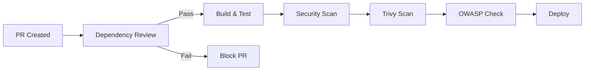

# 🔒 Configuração de Segurança - GitHub Advisory Database

## 📋 Resumo
Este repositório utiliza o **GitHub Advisory Database** como fonte principal para detecção de vulnerabilidades em dependências, evitando dependência direta da NVD (National Vulnerability Database) americana.

## 🛡️ Ferramentas de Segurança Ativas

### 1. Dependabot
- **Localização**: `.github/dependabot.yml`
- **Função**: Verificação automática semanal de vulnerabilidades
- **Fonte**: GitHub Advisory Database
- **Configuração**: 
  - Maven, GitHub Actions e Docker
  - Limites de PRs abertos para evitar spam
  - Auto-assign para revisão

### 2. Dependency Review Action
- **Localização**: `.github/workflows/ci-cd.yml`
- **Função**: Bloqueia PRs com vulnerabilidades high/critical
- **Trigger**: Pull Requests
- **Política**: Falha em vulnerabilidades ≥ High severity

### 3. OWASP Dependency Check (Fallback)
- **Função**: Verificação adicional com timeout de 120s
- **Status**: `continue-on-error: true` (não bloqueia pipeline)
- **Nota**: Pode apresentar warning sobre NVD API Key (ignorável)

### 4. Trivy Scanner
- **Função**: Scan de filesystem e imagens Docker
- **Formato**: SARIF upload para GitHub Security tab

### 5. CodeQL
- **Função**: Análise estática de código
- **Integração**: GitHub Security tab

## 📊 Fluxo de Segurança

## 🚨 Políticas de Vulnerabilidades

### Bloqueio Automático (Dependency Review)
- **High**: Bloqueia PR
- **Critical**: Bloqueia PR
- **Medium/Low**: Permite com warning

### Dependabot Auto-merge
- **Patch updates**: Automático para dependências indiretas
- **Minor updates**: Revisão manual para dependências diretas
- **Major updates**: Sempre requer revisão manual

## 📝 Monitoramento

### GitHub Security Tab
- Todos os resultados centralizados
- Histórico de vulnerabilidades
- Status de correções

### Notificações
- Slack: `#ci-cd-notifications`
- Email: Assignees automáticos
- GitHub: Issues/PRs do Dependabot

## 🔄 Atualizações

### Frequência
- **Dependabot**: Segundas-feiras (09:00 BRT)
- **GitHub Actions**: Segundas-feiras (10:00 BRT)  
- **Docker**: Terças-feiras (09:00 BRT)

### Manutenção
- Revisão mensal das configurações
- Rotação de secrets (quando aplicável)
- Auditoria de dependências críticas

## 📚 Referências
- [GitHub Advisory Database](https://github.com/advisories)
- [Dependabot Configuration](https://docs.github.com/en/code-security/dependabot)
- [Dependency Review Action](https://github.com/actions/dependency-review-action)
